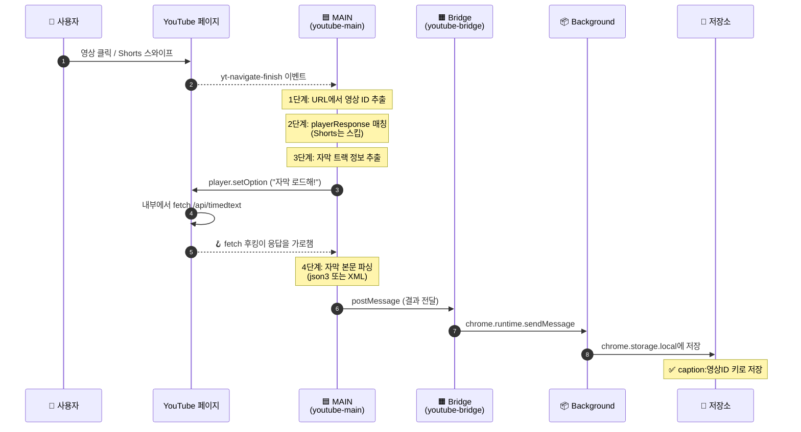
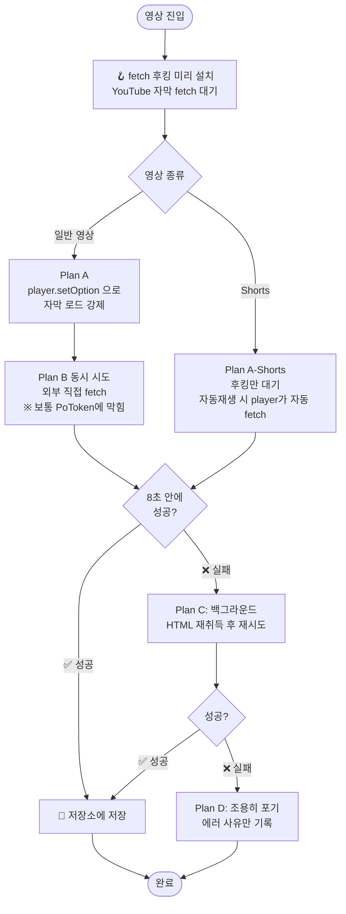

# 🎬 YouTube 자막 자동 추출기

YouTube 영상을 보면 **자막(스크립트)을 자동으로 가져와서 저장**해주는 Chrome 확장프로그램입니다.
모은 자막은 나중에 **광고 구간 자동 탐지**에 쓸 예정.

---

## 🎯 한 눈에 보기

```
   사용자가 YouTube 영상 클릭
              │
              ▼
   ┌──────────────────────────┐
   │  확장프로그램이 자동으로      │
   │  끼어들어 자막을 가져옴        │
   └──────────────────────────┘
              │
              ▼
   ┌──────────────────────────┐
   │  컴퓨터 안에 저장              │
   │  (chrome.storage.local)  │
   └──────────────────────────┘
              │
              ▼
         (다음 단계)
   광고 구간 자동 탐지
```

## 📊 현재 진행 상황

| 단계 | 상태 |
|---|---|
| YouTube 영상 자동 인식 | ✅ 완료 |
| Shorts 자동 인식 (스와이프 포함) | ✅ 완료 |
| 자막 데이터 가져오기 | ⚠️ 부분적 ([왜 어려운가?](#-왜-자막-가져오기가-어려운가) 참고) |
| chrome.storage.local 저장 | ✅ 완료 |
| 광고 구간 자동 탐지 | ⏳ 다음 단계 |
| 자막 문장 단위 분할 | ⏳ 다음 단계 |

---

## 🏗️ 확장프로그램의 3개 부품

확장프로그램은 **3개의 코드 조각**이 동시에 돌아가는 구조입니다.
각 코드는 서로 다른 "방"에 있어서 직접 대화하지 못하고, **메시지로만 소통**합니다.

```
┌──────────────────────────────────────────────────────────────────┐
│                        Chrome 브라우저                              │
│                                                                  │
│  ┌─────────────────────────────────┐    ┌────────────────────┐  │
│  │      YouTube 영상 페이지            │    │   백그라운드          │  │
│  │                                 │    │  (Service Worker)  │  │
│  │  ┌──────────────────────────┐   │    │                    │  │
│  │  │ 🟦 MAIN World              │   │    │  📦 background.ts  │  │
│  │  │   (YouTube 본인 방)          │   │    │                    │  │
│  │  │   📜 youtube-main.ts        │   │    │  • 메시지 수신       │  │
│  │  │                          │   │    │  • 영구 저장          │  │
│  │  │   • 영상 ID 감지            │   │    │  • Plan C 폴백       │  │
│  │  │   • 자막 메타 추출           │   │    │                    │  │
│  │  │   • fetch 후킹              │   │    │                    │  │
│  │  └──────────────────────────┘   │    └────────────────────┘  │
│  │            ⇅ window.postMessage  │              ▲             │
│  │  ┌──────────────────────────┐   │              │             │
│  │  │ 🟧 ISOLATED World          │   │              │ chrome     │
│  │  │   (확장 전용 방)              │   │              │ .runtime  │
│  │  │   📜 youtube-bridge.ts      │───┼──────────────┘ .sendMsg  │
│  │  │                          │   │                            │
│  │  │   • 메시지 중계 (다리)        │   │                            │
│  │  │   • 폴백 트리거             │   │                            │
│  │  └──────────────────────────┘   │                            │
│  └─────────────────────────────────┘                            │
└──────────────────────────────────────────────────────────────────┘
```

### 왜 방을 나눴나?

브라우저가 보안상 **권한을 트레이드오프**로 강제하기 때문입니다:

| | YouTube 변수 직접 접근 | 확장 API 사용 (저장 등) |
|---|---|---|
| 🟦 MAIN world (`youtube-main.ts`) | ✅ 가능 | ❌ 불가 |
| 🟧 ISOLATED world (`youtube-bridge.ts`) | ❌ 불가 | ✅ 가능 |
| 📦 백그라운드 (`background.ts`) | ❌ 불가 (다른 컨텍스트) | ✅ 가능 |

> 그래서 MAIN에서 자막을 모으고 → ISOLATED 다리를 건너 → 백그라운드 저장소로 흘려보냅니다.

---

## 🔄 자막 가져오는 흐름

영상에 진입하면 이 순서로 동작합니다.



---

## 🥷 왜 자막 가져오기가 어려운가?

YouTube는 **자기 데이터를 외부가 가져가는 걸 강하게 막아둡니다.**

### 보안 장치 — PoToken
- 자막 URL은 영상 페이지에 적혀있음 (영상 메타데이터 안에)
- 그런데 그 URL로 직접 GET 요청하면 → **빈 응답**(200 OK + 0 bytes)
- 진짜 자막을 받으려면 **PoToken**이라는 "JavaScript 도장"이 찍혀야 함
- 도장은 YouTube player가 매번 새로 만듦 (BotGuard 챌린지를 풀어서)
- 외부에서는 도장 만드는 방법 모름 (매월 패치되는 술래잡기)

### 비유로 설명
> YouTube: "자막 받으려면 비밀번호 넣어주세요."
> 비밀번호는 YouTube player가 매번 자기 방식으로 만들어냄.
> 외부에서는 그 만드는 법 알 수 없음.
> 단 한 가지 가능한 건 — **player가 자막을 받는 순간 옆에서 같이 받아 적기.**
> ↑ 이게 우리의 "fetch 후킹" 작전.

---

## 🛡️ 다단계 작전 (Plan A → D)

PoToken 우회를 위해 **여러 경로를 동시에** 시도하고, 가장 먼저 성공한 쪽을 채택합니다.



### 작전별 자세히

| 작전 | 무엇 | 언제 성공 | 언제 실패 |
|---|---|---|---|
| **🪝 Plan A** 후킹 | YouTube player가 자막 받을 때 옆에서 가로챔 | player가 실제로 자막을 fetch할 때 | CC가 꺼져있고 자동 트리거가 안 먹을 때 |
| **🌐 Plan B** 직접 | 우리가 직접 자막 URL로 fetch | 차단 안 된 옛날 영상 (드뭄) | 대부분의 최신 영상 |
| **📦 Plan C** 폴백 | 백그라운드에서 영상 HTML 다시 받아 재시도 | playerResponse 못 읽었을 때 | PoToken 차단되면 동일 실패 |
| **🤐 Plan D** 침묵 | 에러 사유만 기록하고 종료 | (실패의 종착지) | — |

### 현실적 한계
- **Plan A는 player가 자막을 fetch해야만 작동**합니다.
  사용자가 CC를 한 번도 안 켰고 자동켜기 설정도 꺼져 있으면 → player는 자막을 안 가져옴 → 우리도 못 잡음.
- 그래서 **다음 단계로 더 안정적인 방법**(녹취록 패널 DOM 스크랩 또는 Whisper STT)을 보강할 예정.

---

## 📂 파일 구조

```
youtube-ad-dectector/
├── 📄 README.md              # 이 문서
├── 📄 CLAUDE.md              # AI 코딩 가이드라인
├── 📄 package.json           # Plasmo 등 의존성
├── 📄 tsconfig.json          # TypeScript 설정
│
├── 📦 background.ts          # 백그라운드 — 저장 + Plan C 폴백
│
├── 📂 contents/              # 페이지에 끼어드는 코드
│   ├── 🟦 youtube-main.ts    #   MAIN world: 자막 추출 본체
│   └── 🟧 youtube-bridge.ts  #   ISOLATED: 메시지 중계 다리
│
├── 📂 lib/                   # 공용 라이브러리
│   ├── messages.ts           #   메시지 타입 정의
│   ├── captions.ts           #   트랙 선택 + 파싱 + fetch 헬퍼
│   ├── playerResponse.ts     #   HTML에서 JSON 추출 (Plan C용)
│   └── storage.ts            #   chrome.storage.local 헬퍼
│
└── 📂 assets/
    └── icon.png              # 확장 아이콘 (placeholder)
```

---

## ⚙️ 설치 / 사용 / 디버깅

### 처음 한 번
```bash
pnpm install      # 의존성 설치
pnpm build        # 프로덕션 빌드 → build/chrome-mv3-prod/
```

### Chrome에 로드
1. `chrome://extensions/` 접속
2. 우측 상단 **개발자 모드** ON
3. **"압축해제된 확장 프로그램 로드"** 클릭
4. `build/chrome-mv3-prod/` 폴더 선택

### 코드 수정 후
```bash
pnpm build
```
1. `chrome://extensions/` 에서 확장 카드의 🔄 클릭
2. YouTube 탭 새로고침 (F5)

### 개발 모드 (코드 저장 시 자동 재빌드)
```bash
pnpm dev
```
이때는 `build/chrome-mv3-dev/` 폴더로 빌드됩니다.

### API 서버 + AI 추론 서버
최종 보고서의 AI 검증을 쓰려면 Next API 서버와 로컬 추론 서버를 함께 켭니다.

```bash
pnpm run dev:servers
```

이 명령은 `server/`의 Next 서버를 `http://localhost:3000`에서, `infer/`의 FastAPI 추론 서버를 `http://127.0.0.1:8000`에서 함께 실행합니다. 기본적으로 Next 서버에는 `HF_CLASSIFY_URL=http://127.0.0.1:8000/classify`가 전달됩니다.

---

## 🔍 디버깅 가이드

### 두 개의 콘솔 창

| 보고 싶은 것 | 어디서 |
|---|---|
| `[yt-cap:main]` `[yt-cap:bridge]` 로그 | YouTube 페이지에서 **F12 → Console** |
| `[yt-cap:bg]` 로그 (백그라운드) | `chrome://extensions/` → 확장 카드의 **"Service Worker"** 링크 |

### 로그 이모지 의미
| 이모지 | 뜻 |
|---|---|
| 🟢 | 단계 시작 |
| 🔄 / 🔍 / 📥 | 진행 중 (대기 / 분석 / 다운로드) |
| ✅ | 단계 성공 |
| ❌ | 단계 실패 |
| ⚠️ | 경고 / 폴백 진행 |
| ⏭️ | 의도적 스킵 (중복 방지) |
| 🪝 | fetch 후킹 작동 |
| 🎬 | YouTube player API 호출 |
| 📌 | 스크립트 / SW 로드 |
| 📨 / 📤 | 메시지 수신 / 송신 |
| 💾 | 저장소에 기록 |
| 🎉 | 전체 파이프라인 완료 |

### 저장된 자막 확인
YouTube 페이지 콘솔에서:
```js
// 모든 저장된 자막 보기
chrome.storage.local.get(null, console.log)

// 특정 영상의 자막만
chrome.storage.local.get('caption:VIDEO_ID', console.log)

// 자막 텍스트만 한 번에 보기
chrome.storage.local.get('caption:VIDEO_ID', (r) => {
  const segs = r['caption:VIDEO_ID']?.data?.segments || []
  console.log(segs.map(s => `[${s.start.toFixed(1)}s] ${s.text}`).join('\n'))
})
```

---

## 📝 다음 단계 (Roadmap)

- [ ] **녹취록 패널 DOM 스크랩** — Plan A보다 안정적인 추출 경로
- [ ] **자막 문장 단위 분할** — 자동 자막(ASR)을 LLM 후처리로 정확한 문장 경계 만들기
- [ ] **광고 구간 자동 탐지** — 분할된 문장에 광고 키워드/문맥 분류 적용
- [ ] **Whisper STT 통합** — 자막 없는 영상도 커버 (백엔드 서버 필요)
- [ ] **popup UI** — 현재 영상의 자막 미리보기 + 광고 구간 하이라이트
